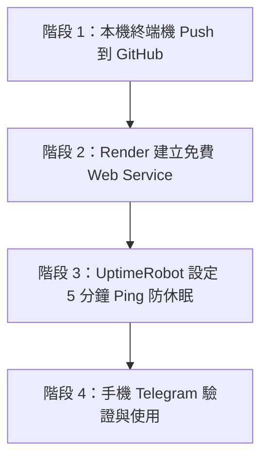

# 📋 PTT & Dcard 監控推播系統 - 家中接續部署工作紀錄與操作手冊

本文件記錄了目前專案的開發進度、架構狀態，以及您使用**家中私人電腦（無公網防火牆限制）**時，如何快速接續完成「推送 GitHub」與「Render 免費 24/7 雲端上線」的完整步驟。

---

## 📌 一、 專案目前完成狀態總覽

1. **專案瘦身與結構優化**：
   - 已清除 3,200+ 個舊版 Node.js / TypeScript 冗餘檔案（`node_modules`、`dist`、`src`、`test` 等），大幅釋放 82MB+ 空間與雲端硬碟同步負擔。
   - 系統已確立以 **Python 3 非同步架構** 為核心（支援 PTT/Dcard 爬蟲、SQLite 動態去重、Telegram 雙向指令互動）。

2. **Render 0 元免費防休眠改造**：
   - 已在 `main.py` 內嵌非同步 Web 健康檢查伺服器（預設監聽 `PORT 10000`，提供 `/health` 端點）。
   - 已建立 `render.yaml` 雲端自動構建設定檔。

3. **本地 Git 狀態**：
   - 本地 Git 倉庫已初始化，所有核心檔案已完成 Commit。
   - `.gitignore` 已配置完畢（自動排除 `.env` 敏感金鑰與本地快取）。
   - 遠端倉庫已綁定至：`https://github.com/keroro14983091/ptt-dcard-monitor.git`。

---

## 🚀 二、 回家使用私人電腦的接續操作步驟（約 5~10 分鐘）

因為您的專案位於 **Google 雲端硬碟**，回家打開私人電腦時檔案會自動同步。請依序執行以下 3 個階段：



---

### 階段 1：將程式碼推送到 GitHub（1 分鐘）

1. 在家中電腦打開 **PowerShell** 或 **命令提示字元 (CMD)**。
2. 切換到專案資料夾並執行推送：
   ```powershell
   cd /d "e:\我的雲端硬碟\Ai agent\PTT、Dcard關鍵字推播系統開發"
   git push -u origin main
   ```
   *(註：若您的雲端硬碟在私人電腦上的磁碟機代號不同，請修改為對應路徑)*
3. 此時會跳出 GitHub 登入授權視窗，點擊 **「Sign in with your browser」** 授權。
4. 推送成功後，前往 [GitHub 倉庫頁面](https://github.com/keroro14983091/ptt-dcard-monitor) 重新整理，確認檔案已全部上傳。

---

### 階段 2：在 Render 建立免費 Web Service（3 分鐘）

1. 前往 **[Render 官網 (render.com)](https://render.com)**，以 **GitHub 帳號登入**（完全免費、免綁信用卡）。
2. 進入 Dashboard 首頁，點擊右上角 **`New +`** ➔ 選擇 **`Web Service`**。
3. 選擇 **`Build and deploy from a Git repository`** ➔ 點擊 **Next**。
4. 在清單中找到 **`keroro14983091/ptt-dcard-monitor`** ➔ 點擊 **Connect**。
   *(若未看到該倉庫，點擊右上角 `Credentials (1)` ➔ `Configure GitHub App` 勾選該倉庫授權)*
5. 填寫服務基本資訊：
   - **Name**：`ptt-dcard-monitor`（或自訂）
   - **Region**：選擇 `Singapore`（新加坡）或 `Oregon`（美國西岸）
   - **Runtime**：選擇 `Python 3`
   - **Build Command**：`pip install -r requirements.txt`
   - **Start Command**：`python main.py`
   - **Instance Type**：選擇 **`Free`** ($0 / month)
6. 下方展開 **`Environment Variables`（環境變數）**，點擊 **Add Environment Variable** 依序新增以下變數：

| 變數名稱 (Key) | 建議值 (Value) | 說明 |
| :--- | :--- | :--- |
| `TELEGRAM_BOT_TOKEN` | *您的 Bot Token* | 向 @BotFather 申請的 Token |
| `TELEGRAM_CHAT_ID` | *您的 Chat ID* | 您的個人或群組 Telegram ID |
| `PTT_BOARDS` | `Stock,Lifeismoney,Gossiping` | 監控看板 (以逗號分隔) |
| `DCARD_BOARDS` | `stock,tech_job` | Dcard 看板 (以逗號分隔) |
| `DEFAULT_KEYWORDS` | `台積電,美股,優惠,買一送一,分紅` | 預設監控關鍵字 |
| `PTT_MIN_PUSH_COUNT` | `50` | PTT 推文達標推播門檻 |
| `DCARD_MIN_LIKE_COUNT` | `50` | Dcard 按讚達標推播門檻 |
| `POLL_INTERVAL_MIN_SEC` | `30` | 爬蟲輪詢最短間隔(秒) |
| `POLL_INTERVAL_MAX_SEC` | `60` | 爬蟲輪詢最長間隔(秒) |
| `DB_PATH` | `./data/monitor.db` | 資料庫檔案路徑 |
| `LOG_LEVEL` | `INFO` | 日誌等級 |

7. 點擊最下方 **`Deploy Web Service`**。
8. 構建完成後，複製左上方 Render 分配給您的專屬網址（例如：`https://ptt-dcard-monitor-xxxx.onrender.com`）。

---

### 階段 3：設定 UptimeRobot 防休眠（2 分鐘）

Render 免費方案在 15 分鐘內無網頁造訪會自動進入休眠，透過 UptimeRobot 定時 Ping 可以維持 **24/7 永不休眠**：

1. 前往免費的 **[UptimeRobot 官網 (uptimerobot.com)](https://uptimerobot.com)** 註冊並登入。
2. 點擊 **`+ Add New Monitor`**：
   - **Monitor Type**：選擇 `HTTP(s)`
   - **Friendly Name**：`PTT Monitor KeepAlive`
   - **URL (or IP)**：填入 Render 網址加上 `/health`，例如：
     `https://ptt-dcard-monitor-xxxx.onrender.com/health`
   - **Monitoring Interval**：選擇 `Every 5 minutes`（每 5 分鐘一次）
3. 點擊 **`Create Monitor`** 完成！

---

## 📱 三、 手機 Telegram 指令使用與驗證

服務部署上線後，您即可關閉電腦，隨時隨地在手機 Telegram 與機器人互動：

| 指令 | 說明 | 範例 |
| :--- | :--- | :--- |
| `/status` | 查詢系統運作狀態、監控看板與推播總數 | `/status` |
| `/list` | 列出目前資料庫中所有監控中的關鍵字清單 | `/list` |
| `/add <關鍵字>` | 即時新增監控關鍵字（即刻生效，無須重啟） | `/add 輝達` |
| `/del <關鍵字>` | 刪除指定的監控關鍵字 | `/del 輝達` |
| `/help` | 顯示所有可用指令與說明 | `/help` |

---

## 🛠️ 四、 常用本地測試指令（備查）

若在家中電腦想在本機執行測試：
- **啟動本地監控**：直接雙擊執行 [`start.bat`](file:///e:/我的雲端硬碟/Ai%20agent/PTT、Dcard關鍵字推播系統開發/start.bat) 或執行 `python main.py`
- **執行系統單元測試**：直接雙擊執行 [`test.bat`](file:///e:/我的雲端硬碟/Ai%20agent/PTT、Dcard關鍵字推播系統開發/test.bat) 或執行 `python -m unittest tests/test_system.py`
